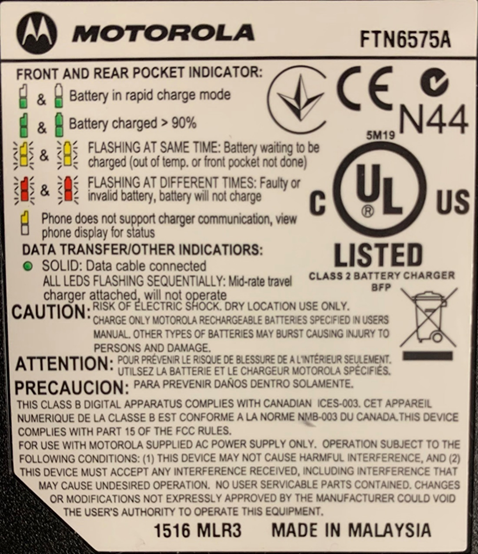

# Akkupflege – Kurzanleitung

## Inhalt
- [Defekte Akkus im Alltag erkennen](#defekte-akkus-im-alltag-erkennen)
  - [Aufblähen oder Verformen](#aufblähen-oder-verformen)
  - [Austretende Flüssigkeit oder Rückstände](#austretende-flüssigkeit-oder-rückstände)
  - [Risse, Löcher oder sichtbare Beschädigungen](#risse-löcher-oder-sichtbare-beschädigungen)
  - [Übermäßige Hitze](#übermäßige-hitze)
  - [Ungewöhnlicher Geruch](#ungewöhnlicher-geruch)
  - [Rauch oder Zischen](#rauch-oder-zischen)
  - [Symptome im Betrieb (ohne sichtbare Schäden)](#symptome-im-betrieb-ohne-sichtbare-schäden)
- [Leere Akkus laden und warten](#leere-akkus-laden-und-warten)
  - [LED-Blink-Codes an der Ladestation](#led-blink-codes-an-der-ladestation)
  - [Zeitlicher Verlauf des Akku-Ladens](#zeitlicher-verlauf-des-akku-ladens)
- [Thermisches Verhalten beim Laden](#thermisches-verhalten-beim-laden)
- [Leere Akkus laden und dabei die Ladekurve prüfen](#leere-akkus-laden-und-dabei-die-ladekurve-prüfen)

---

## Defekte Akkus im Alltag erkennen

### Aufblähen oder Verformen
- Der Akku wirkt dicker als normal
- Gehäuse wölbt sich sichtbar
- Deckel oder Abdeckung lässt sich nicht mehr schließen

Sofort nicht mehr benutzen. Aufblähung ist ein Zeichen für Gasbildung im Inneren.

### Austretende Flüssigkeit oder Rückstände
- Feuchte Stellen
- Ölige oder kristalline Ablagerungen
- Ungewöhnlicher Geruch (süßlich, chemisch, stechend)

Nicht berühren. Die Stoffe können reizend oder giftig sein.

### Risse, Löcher oder sichtbare Beschädigungen
- Gehäuse gebrochen
- Dellen nach einem Sturz
- Offene Stellen, an denen man das Innenleben sieht

Mechanisch beschädigte Akkus können intern Kurzschlüsse haben.

### Übermäßige Hitze
- Akku wird heiß, obwohl er nicht benutzt oder geladen wird
- Akku bleibt heiß, nachdem er vom Ladegerät getrennt wurde

Kann auf einen internen Defekt hindeuten.

### Ungewöhnlicher Geruch
- Süßlich chemischer Geruch
- Schmorgeruch

Ein sehr ernstes Warnsignal.

### Rauch oder Zischen
- Weißer Rauch
- Leises Zischen oder Knacken

Sofort Abstand halten. Das kann ein Vorstadium eines Thermal Runaway sein.

### Symptome im Betrieb (ohne sichtbare Schäden)
Auch ohne äußere Auffälligkeiten können folgende Symptome auf Defekte hinweisen:

- Akku lädt extrem schnell oder extrem langsam
- Gerät schaltet sich plötzlich ab
- Akku entlädt sich ungewöhnlich schnell
- Ladegerät bricht den Ladevorgang ab
- Akku wird beim Laden ungewöhnlich warm

Diese Symptome bedeuten nicht zwingend akute Gefahr, zeigen aber Alterung oder Instabilität.

---

### Was du nicht tun solltest
- Akku nicht öffnen
- Nicht weiterladen oder weiterbenutzen
- Nicht in der Wohnung lagern, wenn er aufgebläht oder heiß ist
- Nicht in den Hausmüll werfen

### Was du stattdessen tun kannst
- Akku in einen nicht brennbaren Behälter legen (z. B. Metallbox, Sand)
- Möglichst draußen oder gut belüftet lagern
- Bei einem Recyclinghof oder Fachhändler abgeben

---

## Leere Akkus laden und warten

### LED-Blink-Codes an der Ladestation
Die LED-Blink-Codes sind auf der Unterseite der Ladestation dokumentiert.

---

## Zeitlicher Verlauf des Akku-Ladens
Das Laden sollte **zwischen 1 und 6 Stunden** dauern. Abweichungen können auf Defekte hinweisen.

### Akku springt sehr schnell auf 80–100 %
- Ladezeit deutlich kürzer als früher
- Gerät zeigt „voll“ an, obwohl kaum Energie aufgenommen wurde

Hinweis auf Kapazitätsverlust.

### Ladegerät bricht frühzeitig ab
- Lade-LED wechselt zu früh auf „voll“
- Ladegerät wird kaum warm

Kann auf eine Schutzabschaltung wegen Zellinstabilität hindeuten.

### Ladezeit steigt plötzlich stark an
- Früher 1 Stunde, jetzt 3–4 Stunden
- Fortschrittsanzeige bleibt lange stehen

Hinweis auf Alterung oder hohen Innenwiderstand.

### Ladegerät startet den Ladevorgang immer wieder neu
- LED wechselt zwischen „laden“ und „bereit“
- Gerät zeigt wiederholt „wird geladen“ an

Schutzschaltungen greifen ein, Akku wirkt instabil.

---

## Thermisches Verhalten beim Laden
Akku und Ladegerät sollten sich leicht erwärmen.

### Akku wird beim Laden kaum warm
- Normalerweise leichte Erwärmung, jetzt gar nicht
- Kaum Stromfluss

Möglicher interner Defekt oder hoher Innenwiderstand.

### Akku wird beim Laden ungewöhnlich warm
- Deutlich wärmer als früher
- Wärme bleibt lange bestehen

Kann auf ineffiziente Ladung oder Zellschäden hindeuten.

### Ladegerät wird sehr heiß
- Ladegerät arbeitet am Limit
- Oft bei schwer ladbaren Akkus

Der Akku zieht ungleichmäßig Strom.

Diese Symptome bedeuten nicht automatisch Gefahr, aber sie zeigen Unzuverlässigkeit.

---

## Leere Akkus laden und dabei die Ladekurve prüfen

Der Stromverbrauch lässt sich mit einer smarten Steckdose (z.B. Shelly Plug S) visualisieren. 
Gesunde Akkus zeigen **3 Phasen**:

### Anstieg des Verbrauchs
Das Ladegerät erkennt den Ladezustand.  
Dauer: **1–3 Minuten**

### Konstantes Laden
Konstanter Verbrauch.  
Wenn der Akku nicht ganz leer ist, ist diese Phase kürzer.

### Reduzierung des Verbrauchs
Das Ladegerät reduziert die Leistung bis zur Voll-Ladung.  
Gegen Ende, bei weniger als 1 Watt Verbrauch werden die Messungen ungenau.  
Die grüne LED am Ladegerät zeigt das Ladeende an.
